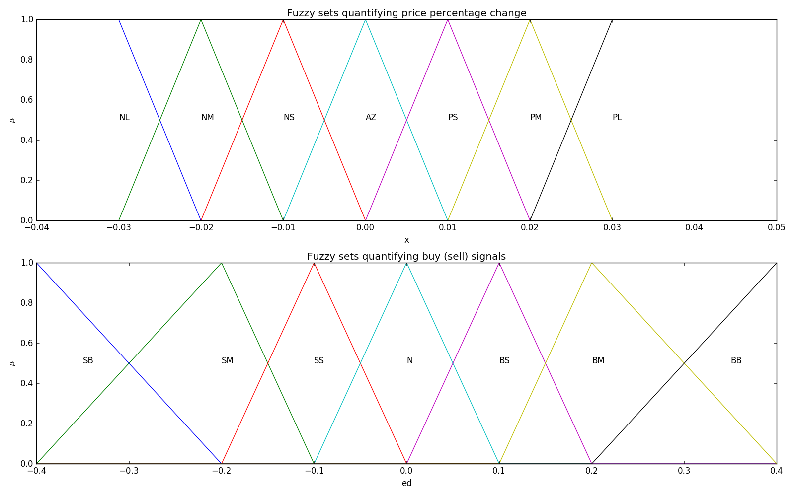

# Dynamic stock price models

An __ongoing__ implementation of dynamic models of stock prices based on technical trading rules. 

A description of the models can be found in a [paper](https://arxiv.org/abs/1401.1888) published by [Li-Xin Wang](https://arxiv.org/find/q-fin/1/au:+Wang_L/0/1/0/all/0/1). For now, **the goal of this implementation is to reproduce the results obtained by Li-Xin Wang** for further study.

# Concept

Agents' (investor) reaction to the stock market depends on a qualitative (__large__, __medium__, __small__) measure of fluctuation in prices. Actions agents perform, such as __invest__ or __withdraw__ are also qualified by the same vague measures. As such, we first formalize the ideas of __large__, __medium__ and __small__ using [fuzzy sets](https://en.wikipedia.org/wiki/Fuzzy_set).

Below is a reproduction of figures 1 and 2 from the paper, depicting two collections of fuzzy sets.
Here are a few of the qualitative measures encoded in the figure.

1. 'PS' - Positive Small
2. 'NM' - Negative Medium
3. 'AZ' - Around Zero
4. 'BS' - Buy Small
5. 'SB' - Sell Big



The model predicts the log ratio (percent change) of stock price between two consecutive time points based on **heuristics** that describe investment strategies of participating investor groups. Below is a list of some of the heuristics used by the model. Refer to the paper for a more in-depth description.

1. Moving Averages [x]
2. Resistance and Support [ ]
3. Trend lines [ ]
4. Market manipulators [ ]
5. Volume and strength rules [ ]
6. Band and stop rules [ ]

# Usage
***As of the lateset commit, only the Moving Averages heuristic is implemented***. To quickly run three simulations with only this heuristic (essentially reproducing figure 3 in the paper), run

```python
python run.py 1 0.2 10 100 500 0.05 2 -v
```


Refer to `run.py` to understand what parameter each value is for.

Figures 1 and 2 in the paper, depicting the memberhsip domains of specific fuzzy sets can now be reproduced by running.

```python
python generate_figures.py
```

